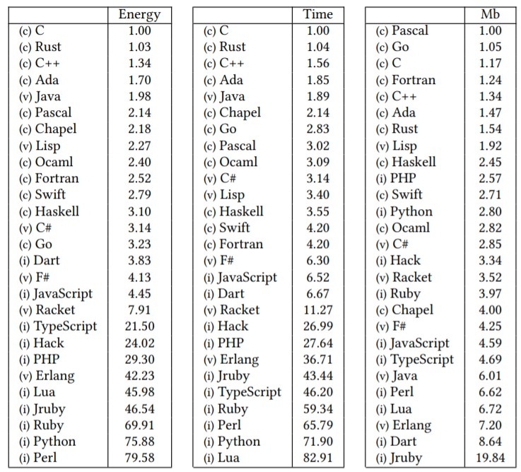

# Choix des langages, des Frameworks et des CMS

## Les langages

Il est possible de créer une application d’une multitude de manières différentes, en utilisant différents langages informatiques, différents frameworks, ou même via l’orchestration d’une multitude de langages et de frameworks tout aussi différents les uns que les autres.

### Le choix du langage, un atout d’éco-conception ?

[]

Les différents langages informatiques ne fonctionnent pas de la même façon, et peuvent influer différemment sur la consommation mémoire de la machine, sur son espace disque, son temps d’exécution, ou sur son efficacité énergétique. Ainsi, si l’on compare le même programme exécuté sur le même environnement codé dans des langages différents, on peut s’apercevoir de ces écarts.

L’étude disponible ici montre qu’il y a de grosses différences pouvant entrainer des choix d’infrastructure différents : Un programme en PERL n’a besoin que de 66Mb pour exécuter un programme, contre 69 en GO, 77 en C, 570 en DART ou même 1309 en JRuby. On observe également que les langages compilés sont beaucoup plus efficients que les langages interprétés. Mieux vaut donc effectuer nos calculs avec des langages compilés.

Bien qu’il puisse être judicieux de connaitre ces problématiques, ce n’est pas forcément sur le choix du langage que tu auras le plus d’impact sur ton applicatif. Si tu souhaites changer les langages utilisés par ton application, il n’est pas certain que les gains dus au changement soient supérieurs à la surconsommation due à la montée en compétences des devs, aux recherches et aux bugs dus à l’appréhension d’un nouveau langage.

### Et concernant les frameworks ?

Les frameworks nous apportent des avantages indéniables dans la conception des applications : ils nous simplifient de nombreuses tâches, nous incitent à utiliser les bonnes pratiques, nous permettent de factoriser nos développements… Il existe différents frameworks pour chaque langage. Par exemple, en PHP, tu pourrais utiliser les framework Zend, Laravel, Symfony ou même Yii. Si tu es plutôt sur du Javascript, tu pourrais utiliser Angular, Node.JS, React.JS, Vue.JS ou un autre.

Quelque soit celui que tu utilises, les performances peuvent être radicalement différentes de l’un à l’autre. Mais c’est aussi le cas d’une version à l’autre : le cœur du framework n’étant pas commun et pouvant changer à chaque évolution, les différents indicateurs de performance peuvent évoluer en permanence. Heureusement, des sites existent pour effectuer ces benchmarks pour nous. C’est le cas de Kinsta (PHP) ou de Plainenglish.io (JavaScript).

Dans leur grande majorité, et quelque soit le langage que tu utilises, les versions les plus récentes des différents frameworks sont bien plus performantes, bien moins gourmandes en ressources que leur version précédentes, il est conseillé d’utiliser les dernières versions, si la compatibilité avec les utilisateurs des versions ultérieures est maintenue : un framework qui n’est opérationnel que sur les versions logicielles ou matérielles récentes peut “forcer” tes utilisateurs et utilisatrices à mettre à jour leur navigateur (ce qui n’est pas forcément une mauvaise chose) mais peut aussi leur faire changer de périphérique dans le cas ou une mise à jour applicative n’est pas compatible avec leur matériel.

Faire changer de matériel à un utilisateur est le pire que nous puissions faire envers nos utilisateurs : d’un point de vue éco conceptuel, le matériel client est le plus gros émetteur de GES du numérique. Éthiquement, ce n’est pas une bonne idée de faire dépenser des sous aux utilisateurs les moins économes pour profiter de nos services, tout comme cela peut-être compliqué de trouver un nouveau téléphone adapté aux handicaps de certaines personnes.

