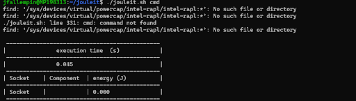

# Utilisation des différents outils d'éco conception

## Argos

### Environnement

Docker  
Docker-compose  
Make : sudo apt install make  

### Installation

>git clone https://github.com/marmelab/argos.git  
>make install

### Lancement

>make start

### Arrêt

>make stop

____

## Power API
### Jouleit
#### **Installation**

>git clone https://github.com/powerapi-ng/jouleit.git  
>cd jouleit/  
 
#### **Lancement**

>./jouleit.sh cmd

### virtual Watts
#### **Sensor**

Virtual watts a besoin des deux sensor un pour la machine hôte hwpc et l’autre pour la VM profcs.  
<https://powerapi-ng.github.io/hwpc-sensor.html>  
<https://powerapi-ng.github.io/procfs-sensor.html>  

#### **Environnement**

Installation de Smart Watts sur la machine hôte linux :
<https://powerapi-ng.github.io/smartwatts.html>  

config :   
>{
  "verbose": true,  
  "stream": true,  
  "input": {  
    "puller": {  
      "model": "HWPCReport",  
      "type": "mongodb",  
      "uri": "mongodb://127.0.0.1",  
      "db": "test",  
      "collection": "prep"  
    }  
  },  
  "output": {  
    "pusher_power": {  
      "type": "mongodb",  
      "uri": "mongodb://127.0.0.1",  
      "db": "test",  
      "collection": "prep"  
    }  
  },  
  "cpu-frequency-base": Ratio Base,  
  "cpu-frequency-min": Ratio min,  
  "cpu-frequency-max": Ratio max,  
  "cpu-error-threshold": 2.0,  
  "disable-dram-formula": true,  
  "sensor-report-sampling-interval": 1000  
>}

Ratio base = tapper “lscpu” trouver le modèle de cpu aller sur la doc trouver la fréquence de base X10  
Ratio min = tapper “lscpu” trouver le ration diviser par 100  
Ratio max = tapper “lscpu” trouver le ration diviser par 100  

#### **Installation**

>docker pull powerapi/virtualwatts-formula

Configuration
>{  
    'verbose': True,  
    "stream":True,  
    "input": {  
        "puller_filedb": {  
            "type": "filedb",  
            "model": "PowerReport",  
            "filename": "SW_output"  
            },  
        "puller_tcpdb": {  
            "type" : "socket",  
            "model": "ProcfsReport",  
            "uri": "127.0.0.1",  
            "port": self.port  
        }  
    },  
    "output": {  
        "power_pusher": {  
        "type": "influxdb",  
        "model": "PowerReport",  
        "uri": "127.0.0.1",  
        "port": 8086,  
        "db": "test",  
        "collection": "prep"  
        }  
    },  
    "delay-threshold": 500,  
    "sensor-reports-sampling-interval": datetime.timedelta(500)  
>}  

#### **Lancement**
>docker run -t --net=host -v $(pwd)/config_file.json:/config_file.json powerapi/virtualwatts --config-file /config_file.json

____

## Scaphandre

Scaphandre est un agent de monitoring de consommation énergétique plus générale, en effet Scaphandre est disponible pour toutes les distributions et est facilement implémentable dans docker.

### installation rapide

>docker run -v /sys/class/powercap:/sys/class/powercap -v /proc:/proc -ti hubblo/scaphandre stdout -t 15

### Installation docker

>git clone https://github.com/hubblo-org/scaphandre.git  
>cd scaphandre/docker-compose  
>docker-compose up -d  

Cela va permettre de lancé scaphandre facilement et d'avoir graphana et prometheus de lancer en même temps. Graphana sera disponible a l'adresse suivante <http://localhost:3000>  avec les identifiants suivant :
- login : admin
- password : secret

____

## EcoCode

EcoCode utilise SonarQube pour tester le code de l'application sous différents languages tel que :
- Java
- PHP
- Python
- Android

EcoCode va permettre de donnés une note globales au code sur son eco conception, mais aussi les points possbiles améliorer a l'aide des retours de SonarQube

### Installation

>git clone https://github.com/cnumr/ecoCode.git  
>cd ecoCode/src  
>mvn clean install  
>cd ..  
>docker-compose up --build -d

Après avoir lancés EcoCode l'application sera disponible a cette adresse <http://localhost:9000> avec les identifiants suivant :
- login : admin
- password : admin

____

## Cloud Carbon Footprint

Cloud carbon footprint est une application rapide a installer sur toutes distribution, elle permet de mesurer les émissions de CO2 par les différents clouds providers :  
- AWS  
- Azure  
- GCP  

De plus, l'application propose des recommandations d'amélioration pour chaque Cloud provider montrant les gains financier et écologique possibles. Cet outils demande un accès au compte du cloud provider il ne sera donc pas utile au développeur mais uniquement au gestionnaires du cloud.

### Environnement

Node > 11  
Yarn  

### Installation

>git clone --branch latest https://github.com/cloud-carbon-footprint/cloud-carbon-footprint.git  
>cd cloud-carbon-footprint  

### Lancement guidé  

>yarn install && yarn guided-install

### Lancement standard

>yarn install  
>yarn start  
